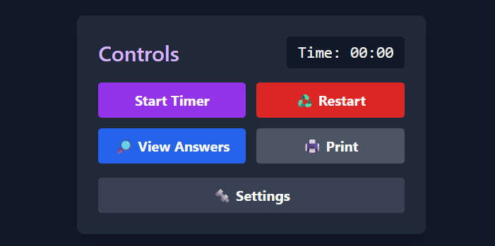

# Mots Croisés

## **Index**
- [Espagnol 🇪🇸](#mots-croisés-🇪🇸)
- [Français](#-mots-croisés)

## **Mots Croisés 🇫🇷**
- [Générer votre propre mot croisé](#générer-votre-propre-mot-croisé-💡)
- [Générer votre propre mot croisé en utilisant un JSON](#générer-votre-propre-mot-croisé-en-utilisant-un-json)
- [Imprimer le mot croisé](#imprimer-le-mot-croisé-🖨️)

### **Générer votre propre mot croisé** 💡

Écrivez le mot qui doit être affiché verticalement, puis cliquez sur le bouton **🚀Allons-y !**


Deux champs de texte seront affichés pour chaque lettre du mot :


- À gauche, saisissez le _mot à deviner_ (la réponse).
- À droite, saisissez la _description_, qui servira d'indice.

Vous pouvez également [générer votre propre mot croisé en utilisant un JSON](#générer-votre-propre-mot-croisé-en-utilisant-un-json), au lieu de saisir manuellement chaque mot et sa description.

### **Générer votre propre mot croisé en utilisant un JSON**

Avec cet outil, vous pouvez charger la structure souhaitée pour créer votre propre **mot croisé personnalisé**. Le mot croisé doit respecter le **format JSON**, avec la structure présentée ci-dessous. Un exemple de JSON est également inclus. Il suffit de modifier les valeurs de l'exemple pour obtenir un nouveau mot croisé.

Accédez à l'outil [en cliquant ici](https://m0nt4ld0.github.io/crucigrama/).


Le JSON doit avoir le format suivant :

- **vword** : Le mot affiché verticalement en tant qu'indice.
- **refs** : Tableau contenant les descriptions (indices) pour deviner les mots.
- **answers** : Tableau contenant les mots réponses.

Voici un exemple :

```
[
  {
     "vword": "Freud",
     "refs": [
        "Ancienne théorie pseudoscientifique aujourd'hui invalide, prétendant déterminer les traits de caractère et de personnalité à partir de la forme du crâne et des traits du visage.",
        "Force qui, lors de l'analyse, «se défend par tous les moyens contre la guérison et veut à tout prix s'accrocher à la maladie et à la souffrance».",
        "Complexe de...",
        "Source de stimuli en flux constant, provenant d'une excitation interne (contrairement à un stimulus externe) et liée à un objet transitoire. Sa satisfaction est partielle.",
        "Projection, introjection, identification projective, tous sont des mécanismes de..."
     ],
     "answers": [
        "phrénologie",
        "résistance",
        "Œdipe",
        "pulsion",
        "défense"       
     ]
  }
]
```

Ce JSON génèrera le mot croisé suivant :


### **Imprimer le mot croisé** 🖨️
Une fois le mot croisé personnalisé chargé, vous pouvez l'imprimer en cliquant sur le bouton correspondant. Une nouvelle page blanche s'ouvrira, avec le mot croisé à compléter et ses indices. Vous pouvez l'imprimer ou l'enregistrer au format PDF.

Cliquez sur le bouton **Imprimer**



La page suivante s'ouvrira pour l'impression. Dans le menu à droite, vous pouvez choisir entre l'imprimer (avec votre imprimante installée) ou l'enregistrer au format PDF.

