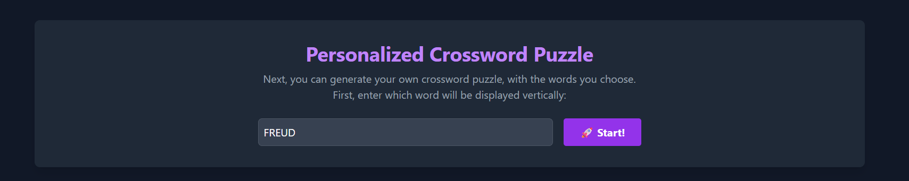
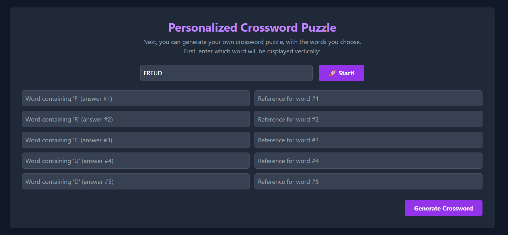
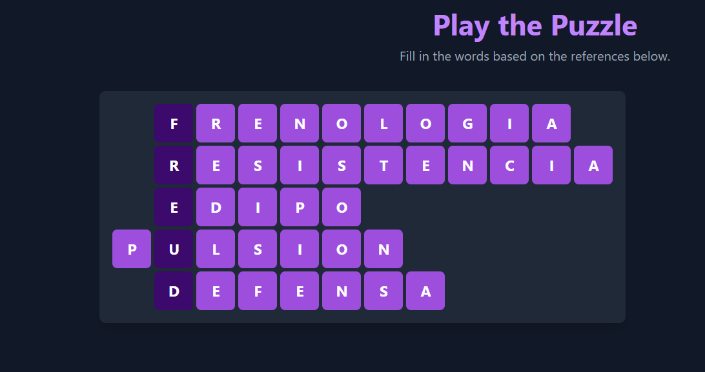

# Crucigrama

## **Índice**
- [Español 🇦🇷](#crucigrama-)
- [Français 🇫🇷](README.fr.md)
- [English 🇬🇧](README.en.md)


### **Crucigrama** 🇪🇸
- [Generar tu propio crucigrama](#generar-tu-propio-crucigrama-)
- [Generar tu propio crucigrama utilizando un JSON](#generar-tu-propio-crucigrama-utilizando-un-json)
- [Imprimir el crucigrama](#imprimir-el-crucigrama-)


### **Generar tu propio crucigrama** 💡

Escribir la palabra que se deberá mostrar de forma vertical y, a continuación, hacer clic en el botón **🚀¡Vamos!**



Se van a desplegar dos cuadros de texto por cada letra de la palabra:



- A la _izquierda_, vamos a ingresar cuál es la _palabra_ que debemos adivinar (la respuesta).
- A la _derecha_, vamos a ingresar la _descripción_, que funcionará como pista.

También se puede [generar tu propio crucigrama utilizando un JSON](#generar-tu-propio-crucigrama-utilizando-un-json), en lugar de ingresar manualmente cada palabra y su descripción.

### **Generar tu propio crucigrama utilizando un JSON**

Con esta herramienta podremos cargar la estructura deseada para armar nuestro propio **crucigrama personalizado**. El crucigrama debe respetar el **formato JSON**, con la estructura que se presenta a continuación. También, se incluye un JSON de ejemplo. Con sólo modificar los valores del JSON de ejemplo, se puede obtener un nuevo crucigrama.

Accede a la herramienta [haciendo clic aquí](https://m0nt4ld0.github.io/crucigrama/).


El JSON a insertar debe contener el siguiente formato:

- **vword**: Es la palabra a modo de "pista" que se muestra verticalmente.
- **refs**: Arreglo con las referencias del crucigrama (descripciones a modo de "pista" para que el jugador intente adivinar la palabra.
- **answers**: Arreglo con las palabras de respuesta.

A continuación, se presenta un ejemplo:

```
[
  {
     "vword": "Freud",
     "refs": [
        "Antigua teoría pseudocientífica, hoy sin validez, que afirmaba poder determinar rasgos del cáracter y de la personalidad basándose en la forma del cráneo y las facciones.",
        "Fuerza que durante el análisis «se defiende por todos los medios contra la curación y a toda costa quiere aferrarse a la enfermedad y el padecimiento»",
        "Complejo de...",
        "Fuente de estímulos en constante fluir, procedente de una excitación interna (a diferencia del estímulo que es externo) y está ligada a un objeto, el cual es transitorio. Su satisfacción es parcial.",
        "Proyección, introyección, identificación proyectiva, todos estos son mecanismos de..."
     ],
     "answers": [
        "frenologia",
        "resistencia",
        "edipo",
        "pulsion",
        "defensa"       
     ]
  }
]
```
Este JSON dará lugar al siguiente crucigrama:



### **Imprimir el crucigrama** 🖨️

Una vez cargado el crucigrama personalizado, podremos imprimirlo haciendo clic en el botón correspondiente. Nos va a abrir una nueva página en blanco, con el crucigrama para completarlo y sus referencias. Podemos imprimirlo, o guardarlo en nuestro equipo como un documento PDF.

Clic en el botón **Imprimir**


Se abre la siguiente página, para la impresión. En el cuadro de selección de la derecha podemos alternar entre imprimirlo (con nuestra impresora instalada y configurada) o guardarlo como PDF.


